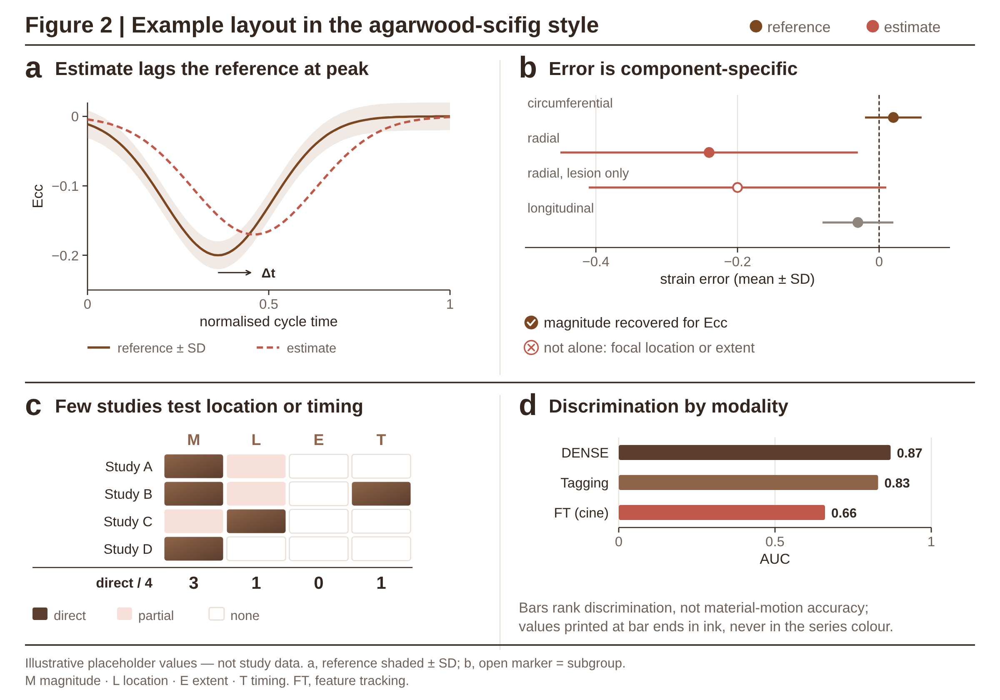

# agarwood-scifig · 沉香科研图风格

自有的科研图风格模板:高信息密度、期刊级、纯矢量。配色来自沈香墨 / 素绢白 / 檀木棕 / 棠梨绯色卡,和 cine-CMR 综述 PPT、v10 图件是同一套体系。以后新画的科研图(论文多面板图、graphical abstract、海报主图)默认都用它。

| 文件 | 用途 |
|---|---|
| [`scifig.py`](scifig.py) | SVG 绘图库:颜色与字号 token、标题/面板/轨道条/✓✕ 行/失败点编号等结构元件,以及坐标轴、曲线、置信带、森林图、区间行、分组柱、横柱、热图、色标、小表等绘图元件;自带 XML 校验和印刷字号审计 |
| [`render.cjs`](render.cjs) | 用无头 Chromium(Playwright)把 SVG 转成 PNG,尺寸取自 SVG |
| [`agarwood.mplstyle`](agarwood.mplstyle) | 同一套风格的 matplotlib 样式,用于真实数据图 |
| [`examples/example_journal.py`](examples/example_journal.py) | 190 mm 双栏宽度的 2×2 最小示例(数值是示意占位) |
| 旗舰示例 [`figures/poster-hero-two-track/`](../../../figures/poster-hero-two-track) | Figure 1 双轨证据图,5 个面板,海报主图尺寸 |



## 快速开始

```bash
cd design-templates/house-style/agarwood-scifig
python3 examples/example_journal.py          # → examples/example_journal.svg + .png
```

```python
import sys; sys.path.insert(0, "design-templates/house-style/agarwood-scifig")
from scifig import Figure, C, T, num

fig = Figure(800, 560, print_width_mm=190, margin=20)    # 期刊双栏;海报主图用 Figure(1800, H, print_width_mm=…)
fig.title("Figure 3 | 一句话说清整张图的结论", legend=[("reference", C.REF), ("estimate", C.INF)])
fig.panel(20, 62, "a", "面板标题直接写这个面板的结论")
ax = fig.axes(70, 82, 290, 150, (0, 1), (-0.25, 0.02), [0, .5, 1], [-.2, -.1, 0], "cycle time", "Ecc")
ax.line(xs, ref, C.REF); ax.line(xs, est, C.INF, dash="5 3")
fig.footer(["a 为示意,非研究数据;b 数值转录自 [12] Table 2。", "缩写:FT, feature tracking; …"])
fig.save("fig3.svg")                          # 输出最小字号在印刷尺寸下是多少 pt
Figure.render_png("fig3.svg", "fig3.png", scale=3)
```

真实数据图(散点、分布、回归等)用 matplotlib 画,`plt.style.use(".../agarwood.mplstyle")`。图件全套构建流程(按 190 mm 导出、PDF 字号审计、面板对齐审计)沿用 [`figures/cine-cmr-review-v10/style/`](../../../figures/cine-cmr-review-v10/style)。

## 两种版式:海报版与期刊版

同一套颜色、字体和元件,按用途分两种版式。先选版式,再画图。

| | 海报版(poster) | 期刊版(journal) |
|---|---|---|
| 用途 | 海报主图、幻灯片、网页概览图;读者可以走近或放大看 | 投稿图、论文正文图、补充图;按实际印刷尺寸读 |
| 画布 | 1800 px 宽,`print_width_mm` 填实际打印宽度(通常 ≥ 600 mm) | 800 px = 190 mm 双栏(或 380 px = 90 mm 单栏);GA 1300 px = 260 mm |
| 字号底线 | 画布上 ≥ 10 px 即可,印刷尺寸下自然 ≥ 7 pt | 正文 10.5 px(7.06 pt),上下标 ≥ 8.5 px(6 pt);`fig.save()` 会校验 |
| 面板数 | 5–8 个面板,一图讲完整个论证 | ≤ 5 个面板、≤ 3 行;讲不完就拆成两张图或放补充材料 |
| 每个子面板 | 图 + 读数表 + 3 行说明 + 失败点编号 | 图 + 1–2 行说明;读数表只在有空间时放 |
| 轨道/分组标记 | 20 px 渐变竖向轨道条,白字旋转大写(`track_strip`) | 不用轨道条;分组写进面板标题("Estimation track: …"),列间细线分隔 |
| 示意图 | 可以用深色 MRI 式影像块、径向渐变、色标 | 只用白底线框示意(素绢白环、箭头、色块填充),不做影像仿真,不做装饰渐变 |
| 图内标题和脚注 | 顶部 "Figure n \| 结论" 标题行 + 底部来源/缩写脚注 | 不放(图注承担);脚本仍写好两套文字,`SCIFIG_TITLES=1` 可打开 |
| 色点类别标签 | 大写字母间距 1.2–2.5 | 同上,但只用于站点/类别标签,不用于正文 |
| 文字换行 | 手动断行 | 用 `wrap()` 按列宽实测换行,所有文本先用 `tw()` 量宽再放 |
| 示例 | [`figures/poster-hero-two-track/`](../../../figures/poster-hero-two-track);[`figures/cine-cmr-review-v10/src/Figure_1_two_track_poster.svg`](../../../figures/cine-cmr-review-v10/src/Figure_1_two_track_poster.svg) | [`examples/example_journal.py`](examples/example_journal.py);[`figures/cine-cmr-review-v10/src/fig1_two_track_journal.py`](../../../figures/cine-cmr-review-v10/src/fig1_two_track_journal.py)(同一张双轨图的期刊版)|

同一张图从海报版改期刊版的做法(以 Figure 1 双轨图为例):去掉与正文其他图重复的面板(误差属性图在 S2、覆盖矩阵在 Table 3、证据计数在 Fig 3b),保留两条轨道;每个站点只留一个图形和两行说明;每列的标题、✓/✕ 行、图题、说明都按列宽实测换行;数值标签放在标记上方或左侧,避免超出列边界;海报里的 MRI 影像块换成线框环。

**一个期刊版画布放不下时,不要缩小字号**:拆图、减面板或把读数移进图注。

## 风格规则

### 1. 画布与尺寸

- 画布纯白。素绢白 `#F8F3E7` 只做局部底色,不做整张画布。
- 期刊:按 190 mm 双栏设计,画布 **800 px 宽**,此时 10.5 px 约等于 7 pt。单栏 90 mm 用 380 px 宽。
- 海报主图:画布 **1800 px 宽**,`print_width_mm` 填实际打印宽度。
- 字号底线:印刷尺寸下正文 ≥ 7 pt,上下标 ≥ 6 pt(Elsevier 标准)。`fig.save()` 每次都会打印最小字号,低于 7 pt 会提示。

### 2. 字体与字号(单位 px;海报画布 1800 px 与期刊画布 800 px 用同一套数值,所以期刊版每个字相对更大、内容更少)

| 角色 | 字号 | 字重 | 颜色 |
|---|---|---|---|
| 图标题 `Figure n \| 结论` | 18 | 700 | 墨色 |
| 面板字母(小写 a b c) | 24 | 700 | 墨色 |
| 面板标题(写结论,不写主题词) | 15 | 700 | 墨色 |
| 子面板标题 + 文献号 | 13.5 | 700 + 400 灰 | 墨色 / 次要灰 |
| 正文、行标签 | 11–12.5 | 400 | 墨色 |
| 说明行(子面板下方 2–3 行) | 11.5 | 400 | 次要灰 |
| 刻度、脚注、图例 | 10.5–11 | 400 | 次要灰 |

字体用 Helvetica / Arial,环境里没有时用 Liberation Sans(字宽与 Arial 一致)。公式用斜体,下标写成 `<tspan baseline-shift="sub">`(`fig.rich` 第五个参数),不要用 Unicode 组合字符,比如 φ̂ 会渲染错位。

### 3. 颜色:按角色使用,每张图里含义不变

| token | 色值 | 角色 |
|---|---|---|
| `C.OBS` | `#8E857D` | 观测 / 输入 / 中性 |
| `C.INF` | `#C0584A` | 推断 / 估计(虚线 `5 3`) |
| `C.REF` | `#7A4720` | 参照 / 验证(实线) |
| `C.AGAR` / `C.DEEP` | `#8D6449` / `#5B3E2E` | 主数据色;"直接终点"、最强类别 |
| `C.SANDAL` / `C.PEAR` | `#C0997F` / `#E7A49A` | 次级数据、色带、渐变端点 |
| `C.CORAL` | `#CC5F4F` | 次级类别区分 |
| `C.MASK` | `#B2AAA2` | 最弱证据类(有意用中性灰) |
| `C.SUP` | `#4E7470` | 支持 / 成立,唯一的冷色 |
| `C.ERR` | `#A33A2E` | 误差 / 丢失,只用于线和符号 |
| `C.INF_T` `C.REF_T` `C.SUP_T` | 浅底 | 部分 / 间接、分组底色 |
| `C.INK` / `C.MUTED` | `#33261F` / `#6F625A` | 文字 |
| `C.GRID` / `C.RULE` | `#E8DFD6` / `#CDBFB2` | 网格、分栏细线 |

- **文字一律用墨色或次要灰**,数值标签也一样,不跟数据系列同色。颜色只给线、点、柱、色块。例外有三种:类别标签(带色点的 `OBSERVED` 等)、失败点编号圈、公式里需要强调的那一项。
- 原色卡四色饱和度低、色相相近,直接当数据色分不开:沈香墨和棠梨绯在色盲模拟下 ΔE 只有 0.8。所以数据色用上表的加深版。新加颜色前,先用 dataviz skill 的配色校验器检查同一张图里同时出现的颜色对。
- 渐变只放在编码信息的地方:色标(`CMAP_STRAIN`)、热图的"直接"格、轨道条、表示开放区间的渐隐柱。不做装饰性渐变。

### 4. 版式:白底、细线、无卡片

- 不用圆角卡片、阴影、彩色底块。层级靠字号、字重、灰度和留白来分。
- 行与行之间用 1.2 px 墨色粗线(`row_rule`),列与列之间用 0.8 px 浅灰细线(`col_rule`)。
- 有两条或多条并行"轨道"时(比如估计 vs 验证、训练 vs 推理),左侧放 20 px 宽的竖向渐变轨道条(`track_strip`),上面写旋转的大写白字。
- 每个面板 = 小写粗体字母 + 一句结论式标题。子面板 = 类别标签(色点 + 大写)+ 粗体小标题 + 文献号。
- 流程用"站点 + 箭头 + 箭头上方的斜体动词"(inferred / differentiate / aggregate),不画方框。
- 失败点、步骤用带圈编号(`badge`),同一编号在图内的图例行里解释一次。
- "能证明 / 不能单独证明"用 `check` / `cross` 两行,✕ 行文字用次要灰,只有符号是红色。

### 5. 信息密度

目标是读者不翻正文也能拿到数字。

- 每个绘图元素都要有数值:柱端、点旁直接标数字,区间写成 `0.92–0.94`,均值写成 `0.02 ± 0.04`。
- 子面板下方写 2–3 行次要灰说明(每行约 60–75 字符,手动断行),内容包括 n、队列、参照标准、关键限制。
- 示意图里也要放可量化的内容,比如坐标轴、色标、读数小表(`kv_table`)、Δ 标注,不要只放图标。
- 留白只放在面板之间。一个子面板里如果有大片空白,就补一个小图或一张读数表。
- 底部脚注两行:第一行写数据来源和性质(哪些是示意、哪些转录自哪张表、哪些不可合并),第二行写缩写表。

### 6. 图形元素

- 线宽:数据线 1.8,次要曲线 1.2,强调 2.2;坐标轴 0.9;网格 0.8。
- 参照实线、估计虚线 `5 3`、零线或无效线虚线 `3 2`。
- 实心点 = 被评估方法,空心点 = 对照或亚组。
- 坐标轴只画左边和下边,刻度向外 4 px,刻度标签用次要灰;负号用真减号 `−`(`num()` 会自动转换)。
- 区间用圆头粗线(`range_rows`),森林图用细线加点(`forest`)。

### 7. 诚实性

- 示意面板和数据面板要在脚注里明确区分。示意图不写看起来像实测的数值。
- 转录的数字都标注来源(文献号、表号或节号)。不同研究的量纲不同时,注明"not pooled"。
- 不编数据;占位数值要写明 "illustrative"。

## 质检清单(每张图交付前)

1. `fig.save()` 没有报错(XML 合法),最小字号在印刷尺寸下 ≥ 7 pt(上下标 ≥ 6 pt)。
2. 用 `render_png(scale=3)` 渲染后整图目检一遍,再把各区域裁剪放大检查:文字不重叠、不越过分栏线、不压到曲线。
3. 文字颜色全是墨色或次要灰(例外见第 3 节)。
4. 每个面板标题都是一句结论;每个数据元素都有数值或刻度。
5. 脚注已写明示意 / 数据的性质、来源和缩写。

## 已知限制

- `scifig.py` 不会自动排版:所有坐标都要手写。好处是位置可控、可审阅,代价是改尺寸时要一起调坐标。
- 文本宽度靠字符数估算(图例、标题图例)。长标签请渲染后目检。
- SVG 里的文字是可编辑的 `<text>`,在没有 Helvetica / Arial 的机器上会回退到其他无衬线字体。投稿要出 PDF 时,用 Chromium 打印或 Inkscape 转换并嵌入字体。
